# aic-nixie

> An ESP8266-based 6-digit IN-12B nixie counter that queries the Art Institute of Chicago's API

<a href="https://raw.githubusercontent.com/IllyaMoskvin/aic-nixie/master/images/gallery/00-hero.jpg">
    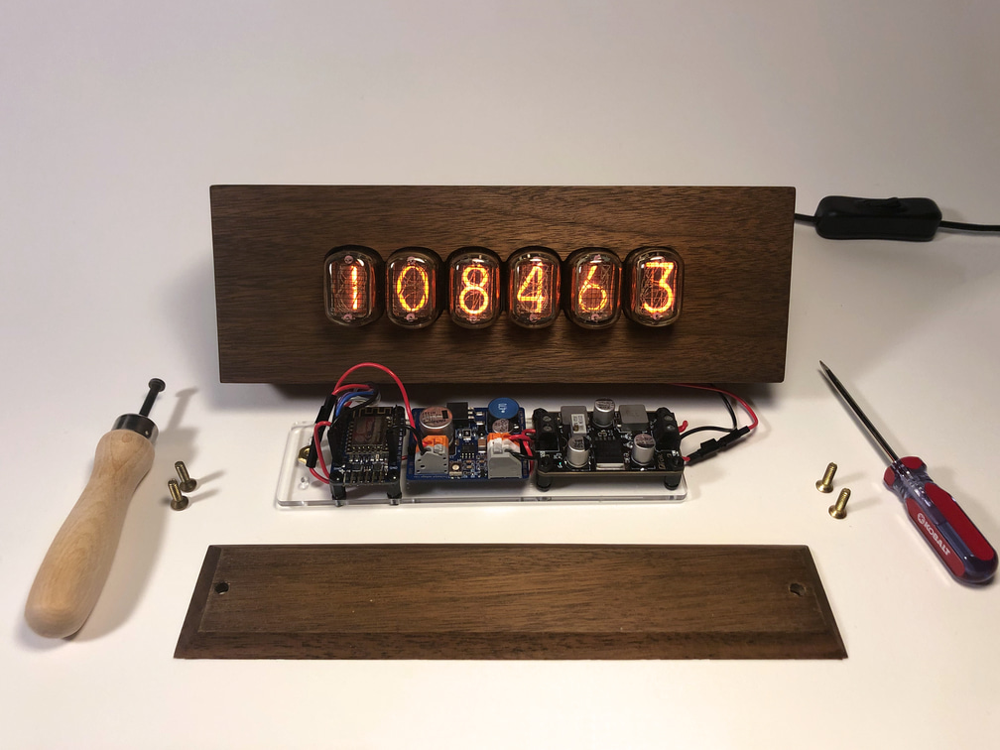
</a>

While working as a web developer at the Art Institue of Chicago, I got the idea that it would be neat to have some physical manifestation of the work we were doing. My work at the time focused on [interconnecting systems](https://mw19.mwconf.org/paper/building-a-data-hub-microservices-apis-and-system-integration-at-the-art-institute-of-chicago/) and creating a [public API](https://www.artic.edu/open-access/public-api), so I decided to make a counter that would show the number of artworks that have been updated in our API each day. Further, I wanted the counter to be a piece of art in its own right. It had to feel high quality, analog, and hand made.

Long story short, what you find here is the end result. My nixie counter connects to Wi-Fi using an ESP8266. It queries a Python microservice that's running on e.g. my desktop computer and displays whatever number gets returned. This allows me to easily change what the counter displays, without having to reflash it.

Over time, what this project represents has shifted in practice to be less about the Art Institute's data and more about my own workflows. For example, yes, it can display [artworks updated since 9 AM CT](server/aic.py), but it can also display the [current word count of a Markdown file](server/wc.py). But the core idea of having a physical manifestation of some digital count has stayed constant.

This repository contains a write-up of the project, along with designs for the enclosure and all related code. This was my first woodworking and Arduino project. As such, this write-up is written from the perspective of a beginner. Some parts here may seem obvious to more seasoned makers. If you spot any mistakes or misconceptions, please [open an issue](https://github.com/IllyaMoskvin/aic-nixie/issues).

## Table of Contents

 * [Photo Gallery](#photo-gallery)
 * [Inspiration](#inspiration)
 * [Design](#design)

## Photo Gallery

<table>
    <tr>
        <td>
            <a href="https://raw.githubusercontent.com/IllyaMoskvin/aic-nixie/master/images/gallery/01-front.jpg">
                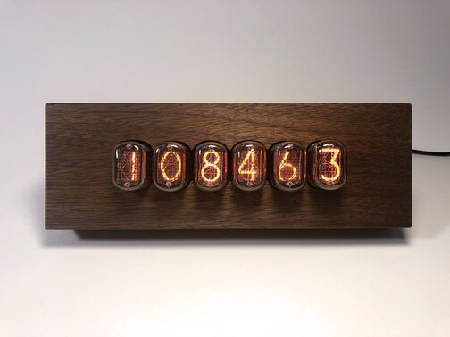
            </a>
        </td>
        <td>
            <a href="https://raw.githubusercontent.com/IllyaMoskvin/aic-nixie/master/images/gallery/02-three-quarters.jpg">
                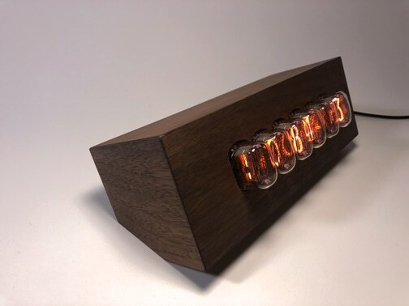
            </a>
        </td>
        <td>
            <a href="https://raw.githubusercontent.com/IllyaMoskvin/aic-nixie/master/images/gallery/03-side.jpg">
                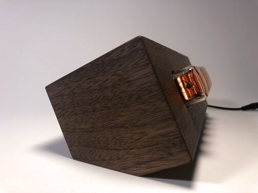
            </a>
        </td>
    </tr>
    <tr>
        <td>
            <a href="https://raw.githubusercontent.com/IllyaMoskvin/aic-nixie/master/images/gallery/04-back.jpg">
                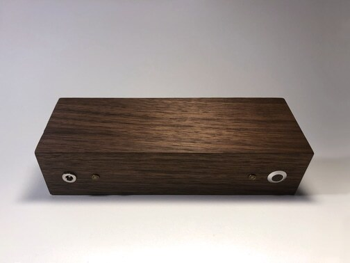
            </a>
        </td>
        <td>
            <a href="https://raw.githubusercontent.com/IllyaMoskvin/aic-nixie/master/images/gallery/05-bottom.jpg">
                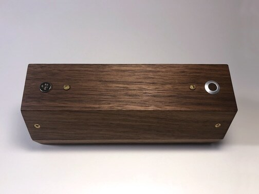
            </a>
        </td>
        <td>
            <a href="https://raw.githubusercontent.com/IllyaMoskvin/aic-nixie/master/images/gallery/06-button.jpg">
                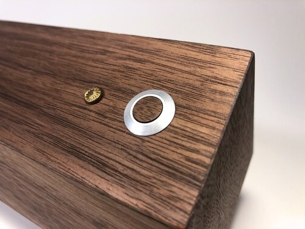
            </a>
        </td>
    </tr>
    <tr>
        <td>
            <a href="https://raw.githubusercontent.com/IllyaMoskvin/aic-nixie/master/images/gallery/07-lid-off.jpg">
                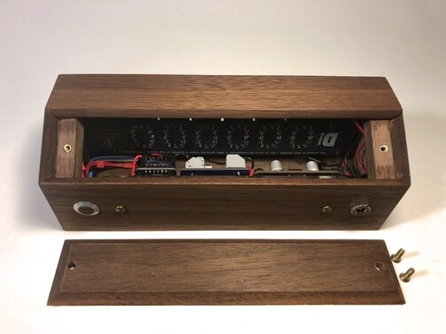
            </a>
        </td>
        <td>
            <a href="https://raw.githubusercontent.com/IllyaMoskvin/aic-nixie/master/images/gallery/08-inside-left.jpg">
                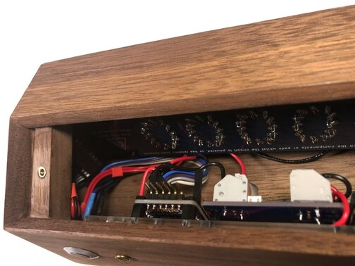
            </a>
        </td>
        <td>
            <a href="https://raw.githubusercontent.com/IllyaMoskvin/aic-nixie/master/images/gallery/09-inside-right.jpg">
                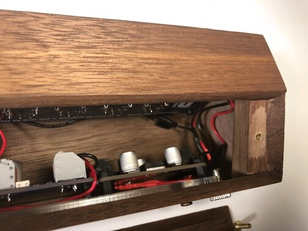
            </a>
        </td>
    </tr>
</table>

## Inspiration

I looked at hundreds of nixie clocks while designing this counter. The most direct inspiration for this project turned out to be a clock made by [NixieDream](https://www.etsy.com/shop/NixieDream) on Etsy. I don't know when exactly this clock was made, but by the time I found it through Pinterest in mid-February 2019, it had already been sold.

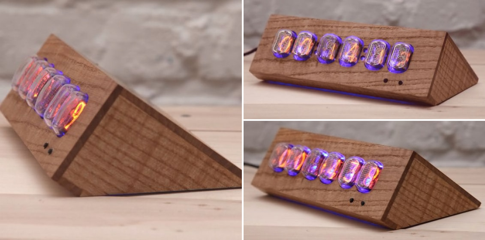

What did I like about this design? I loved the idea of having the front face of the counter tilt backwards. This way, when the counter was placed on a tabletop, it would face a sitting or standing viewer more head-on than if the front face was simply perpendicular to the table's surface. I liked how the grain of the wood on the sides of this clock emphasized its directionality. Overall, I liked its angles and proportions.

That said, there were things about it I wanted to change. For one, I did not like how deep the nixie tubes sat within the front face. Each nixie tube has a stack of digits in it. Watching the digits change conveys a sense of dimensionality, which gets lost somewhat when the tubes are set so deep. I wanted to clean up the design by moving the button(s) to the rear and hiding the seams between the pieces of wood. Lastly, I wanted to reduce the footprint of this design by foreshortening the back, giving it a more square profile.

Taken in sum, these changes promised to be a challenge, both in terms of woodworking and component layout. Through these changes, my intention was to make my counter stand on its own—in conversation with NixieDream's clock, but not merely a remix. Here's hoping that I succeeded!

## Design

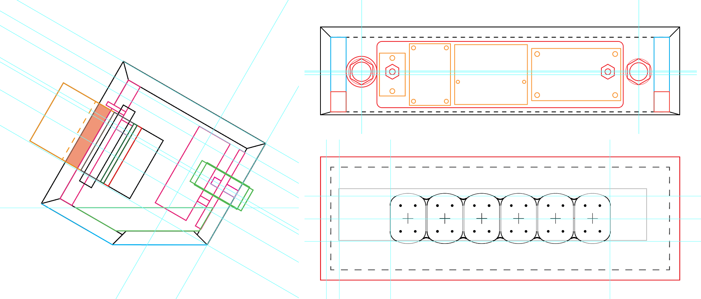

This counter was designed entirely in Adobe Illustrator CC. At the time, I was not proficient with 3D CAD software. I have no interest in making this design particularly easy to reproduce, but I'm willing to share the files:

 * [side.ai](designs/side.ai)
 * [back.ai](designs/back.ai)
 * [front.ai](designs/front.ai)

I made an effort to organize their contents, but they are provided as-is. There are definitely some inaccuracies relative to the finished product. For example, you may notice that the acrylic piece was designed to mount a fourth PCB—this [TXS0108E 8-bit bi-directional level-shifter breakout](https://www.addicore.com/TXS0108E-p/ad284.htm). Turns out, it wasn't needed? Also, I used a different button than the one measured for the designs, so don't trust those measurements.

There are a couple things I'd change here, too. I'd make the two Forstner holes slightly bigger, especially for the button. I'd maybe make the indentations for the #6 nuts slightly bigger, too. While cleaning up the design files, I noticed that all of the holes on the back should have been at least 0.5mm higher. I haven't noticed it while tinkering with the counter for the past year or so, but yeah, that flaw made it into the end product. Unfortunate, but in a way, that makes it more human.

In terms of the design process, it was just a cycle of measuring things with digital calipers, nudging vectors around, and doing mental math. I made a paper prototype at one point to get a sense of scale and to sanity-check that the nixie tubes would indeed fit into the cutouts. Overall, I think the final product turned out to be very close to the design, [which is great](https://www.oxfordreference.com/view/10.1093/acref/9780199539536.001.0001/acref-9780199539536-e-1418).

Please note that the pattern for the front panel cutout was derived from [IN-12.svg](http://reboots.g-cipher.net/time/IN-12.svg) shared by [Engram Enterprises](http://reboots.g-cipher.net/) as part of their [Amy Time! Nixie Tube Clock](http://reboots.g-cipher.net/time/) project. Thank you!
