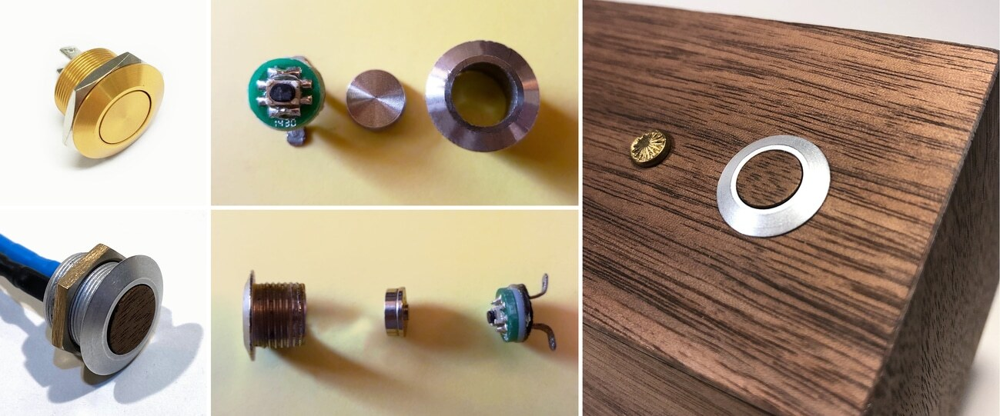

# aic-nixie

> An ESP8266-based 6-digit IN-12B nixie counter that queries the Art Institute of Chicago's API

While working as a web developer at the Art Institue of Chicago, I got the idea that it would be neat to have some physical manifestation of the work we were doing. My work at the time focused on [interconnecting systems](https://mw19.mwconf.org/paper/building-a-data-hub-microservices-apis-and-system-integration-at-the-art-institute-of-chicago/) and creating a [public API](https://www.artic.edu/open-access/public-api), so I decided to make a counter that would show the number of artworks that have been updated in our API each day. Further, I wanted the counter to be a piece of art in its own right. It had to feel high quality, analog, and hand made.

Long story short, what you find here is the end result. My nixie counter connects to Wi-Fi using an ESP8266. It queries a Python microservice that's running on e.g. my desktop computer and displays whatever number gets returned. This allows me to easily change what the counter displays, without having to reflash it.

Over time, what this project represents has shifted in practice to be less about the Art Institute's data and more about my own workflows. For example, yes, it can display [artworks updated since 9 AM CT](server/aic.py), but it can also display the [current word count of a Markdown file](server/wc.py). But the core idea of having a physical manifestation of some digital count with an emphasis on measuring work has stayed constant.

This repository contains a write-up of the project, along with designs for the enclosure and all related code. This was my first woodworking and Arduino project. As such, this write-up is written from the perspective of a beginner. Some parts here may seem obvious to more seasoned makers. If you spot any mistakes or misconceptions, please [open an issue](https://github.com/IllyaMoskvin/aic-nixie/issues).

## Table of Contents

 * [Photo Gallery](#photo-gallery)
 * [Inspiration](#inspiration)
 * [Design](#design)
 * [Components](#components)
   * [Nixie Tubes: IN-12B](#nixie-tubes-in-12b)
   * [Doayee's Nixie Driver](#doayees-nixie-driver)
   * [Acrylic-Mounted PCBs](#acrylic-mounted-pcbs)
     * [Adafruit HUZZAH ESP8266 Breakout](#adafruit-huzzah-esp8266-breakout)
     * [HV PSU: YanZeyuan’s NCH6100HV](#hv-psu-yanzeyuans-nch6100hv)
     * [LV PSU: DROK LM2596](#lv-psu-drok-lm2596)
 * [Assembly](#assembly)
   * [Acrylic Plate for PCBs](#acrylic-plate-for-pcbs)
   * [Walnut Wood Enclosure](#walnut-wood-enclosure)
   * [Wiring](#wiring)
   * [miTEC MSW-12A01 Button](#mitec-msw-12a01-button)

## Photo Gallery

<table>
    <tr>
        <td>
            
        </td>
        <td>
            
        </td>
        <td>
            
        </td>
    </tr>
    <tr>
        <td>
            
        </td>
        <td>
            
        </td>
        <td>
            
        </td>
    </tr>
    <tr>
        <td>
            
        </td>
        <td>
            
        </td>
        <td>
            
        </td>
    </tr>
</table>

## Inspiration

Without exaggeration, I looked at hundreds of nixie clocks while designing this counter. The most direct inspiration for this project turned out to be a clock made by [NixieDream](https://www.etsy.com/shop/NixieDream) on Etsy. I don't know when exactly this clock was made, but by the time I found it through Pinterest in mid-February 2019, it had already been sold.

What did I like about this design? I loved the idea of having the front face of the counter tilt backwards. This way, when the counter was placed on a tabletop, it would face a sitting or standing viewer more head-on than if the front face was simply perpendicular to the table's surface. I liked how the grain of the wood on the sides of this clock emphasized its directionality. Overall, I liked its angles and proportions.

That said, there were things about it I wanted to change. For one, I did not like how deep the nixie tubes sat within the front face. Each nixie tube has a stack of digits in it. Watching the digits change conveys a sense of dimensionality, which gets lost somewhat when the tubes are set so deep. I wanted to clean up the design by moving the button(s) to the rear and hiding the seams between the pieces of wood. Lastly, I wanted to reduce the footprint of this design by foreshortening the back, giving it a more square profile.

Taken in sum, these changes promised to be a challenge, both in terms of woodworking and component layout. Through these changes, my intention was to make my counter stand on its own—in conversation with NixieDream's clock, but not merely a remix. Here's hoping that I succeeded!

## Design

This counter was designed entirely in Adobe Illustrator CC. At the time, I was not proficient with 3D CAD software. I have no interest in making this design particularly easy to reproduce, but I'm willing to share the files:

 * [side.ai](designs/side.ai)
 * [back.ai](designs/back.ai)
 * [front.ai](designs/front.ai)

I made an effort to organize their contents, but they are provided as-is. There are definitely some inaccuracies relative to the finished counter. For example, you may notice that the acrylic piece was designed to mount a fourth PCB—this [TXS0108E 8-bit bi-directional level-shifter breakout](https://www.addicore.com/TXS0108E-p/ad284.htm). Turns out, it wasn't needed? Also, I used a different button than the one measured for the designs. Generally, the measurements for the back cutouts don't quite reflect the final product.

There are a couple things I'd change here, too. I'd make the two Forstner holes slightly bigger, especially for the button. I'd maybe make the indentations for the #6 nuts slightly bigger, too. While cleaning up the design files, I noticed that all of the holes on the back should have been at least 0.5mm higher. I haven't noticed it while tinkering with the counter for the past year or so, but yeah, that flaw made it into the end product. Unfortunate, but in a way, that makes it more human.

In terms of the design process, it was just a cycle of measuring things with digital calipers, nudging vectors around, and doing mental math. I made a paper prototype at one point to get a sense of scale and to sanity-check that the nixie tubes would indeed fit into the cutouts. Overall, I think the final product turned out to be very close to the design, [which is great](https://www.oxfordreference.com/view/10.1093/acref/9780199539536.001.0001/acref-9780199539536-e-1418).

Please note that the pattern for the front panel cutout was derived from [IN-12.svg](http://reboots.g-cipher.net/time/IN-12.svg) shared by [Engram Enterprises](http://reboots.g-cipher.net/) as part of their [Amy Time! Nixie Tube Clock](http://reboots.g-cipher.net/time/) project. Thank you!

## Components

As a newcomer to electronics, I knew that I'd have to use off-the-shelf parts where possible, within reason. I had to balance learning new things versus getting this project done, and there was plenty to learn here already. Plus, nixie tubes are high-voltage devices. I wanted to minimize the risk of harming components or myself.

### Nixie Tubes: IN-12B

This counter uses [IN-12B](http://www.swissnixie.com/tubes/IN12B/) tubes, made in the USSR in 1985. "Nixie" is a generalized trademark, originally filed by the [Burroughs Corporation](http://www.jb-electronics.de/html/elektronik/nixies/n_nixie_geschichte.htm?lang=en) in 1956. It's a type of [cold-cathode tube](https://www.explainthatstuff.com/how-nixie-tubes-work.html), related to neon tubes. There's a stack of metal digits in each tube. Each digit is connected to a small pin that sticks out of the tube, plus one pin for power. Once positive voltage is applied to the power pin (anode), we can make any digit light up by connecting its pin to ground (cathode).

Nixies haven't really been mass-produced since the 80s, but there's still a fair bit of "new old stock" (NOS) kicking around, and there's a few people trying to revive the art of manufacturing these. There's a definite niche for nixies in industrial art projects like this one. As a result, there's currently a lot of knowledge online about nixies.

For this project, I wanted to use [end-view tubes](http://www.tube-tester.com/sites/nixie/trade03-nixie-tubes.htm) that were cheap and had [good community support](https://hackaday.io/search?term=nixie). Originally, I looked at the [IN-1](http://www.tube-tester.com/sites/nixie/data/in-1/in-1.htm) or the [IN-12A](http://www.tube-tester.com/sites/nixie/data/in-12a.htm). Once I found Doayee's driver, [IN-12B](http://www.tube-tester.com/sites/nixie/data/in-12b.htm) was an easy choice. Having a decimal point was an unexpected bonus, which allowed me to show IP addresses via the nixies.

### Doayee's Nixie Driver

[Doayee](https://doayee.co.uk/) is a small bespoke electronic project store and hobbyist blog based in the UK. They created a [Nixie Tube Driver](https://doayee.co.uk/nixie/), which they [Kickstarted](https://www.kickstarter.com/projects/doayee/nixie-tube-driver) in 2017 and have subsequently offered for sale via [Tindie](https://www.tindie.com/products/Doayee/nixie-tube-driver/). This driver is what made my project possible. Nothing else had the perfect combination of form factor, ready availability, and Arduino library support.

That said, I ran into some issues, too. But before I get into all that, I just want to express how awesome the Doayee guys were at providing support. I reached out to them via email, and they did their genuine best to help me debug things. We were unsuccessful, but at some point, that doesn't matter. The effort they put into helping a newbie went above and beyond what I'd expect from a shop of thier size.

Unfortunately, I went through _three_ of these boards while working on this project. For the most part, I have only myself to blame. My first board, I shorted HV to 5V while measuring voltage. The second board, some strange issues appeared after a few weeks of operation. The third board is still going strong. Lesson learned: if you are new to electronics, order extra parts!

The second board had to be retired because the "4" digit in one of the tubes [refused to turn off](https://www.dropbox.com/s/mgjyzf93gjzlxyp/IMG_0748.MOV?dl=0). This issue did not surface until about 50 hours of operation. I asked Doayee about it, and though they tried to help me debug the problem, we were unsuccessful. It seems that something caused the "4" pin to become grounded. Possible solder mask damage?

I'm not really knowledgable enough yet to speculate on the matter, but tenatively, I think that some of the traces come too close to the through-holes for the [PL31A-P](https://www.steampunkalchemy.com/en/nixie-tubes/sockets-pins-driver-ic) socket pins. My best guess so far is that I might have damaged the solder mask of an adjacent trace while soldering a pin, creating a short. I don't know why it would take 50 hours of operation for that to manifest itself, though. Maybe the heat from the nixies served to further degrade the solder mask? They don't run hot, but they do run warmer than room temperature.

According to the documentation, this driver operates at a 5V [logic level](https://learn.sparkfun.com/tutorials/logic-levels/all). Most Arduino devices nowadays use 3.3V logic. That includes the ESP8266. I thought I'd need to convert between the two logic levels. I tried using a [TXS0108E](https://www.addicore.com/TXS0108E-p/ad284.htm) level shifter between the ESP8266 and the driver. This bugged out on me in ways that were difficult to diagnose. Sometimes, digits would flicker or refuse to light. Other times, all of the segments would light up at the same time—not all at once, but incrementally, until every segment on every tube was lit. My best guess is that the level shifter interfered with the way the clock signal was being trigged manually by the driver library to send data.

Eventually, I realized that the [74LVC1G79](https://assets.nexperia.com/documents/data-sheet/74LVC1G79.pdf) and [HV5122](http://ww1.microchip.com/downloads/en/DeviceDoc/20005418B.pdf) on the driver board work just fine with 3.3V logic, so I tried it without the level shifter. The nixies seemed to work fine without it. I found that [/u/wkrp28 on Reddit](https://old.reddit.com/r/arduino/comments/83s09b/ive_always_wanted_a_nixie_clock_and_finally_made/) had already build a clock using Doayee's driver and the ESP8266 without level shifting. I asked Doayee if the board could handle 3.3V logic. They said that operating with 5V Vdd and 3.3V signal lines comes quite close to the Vih threshold of Vdd-2.0, which might cause errors, but it is highly unlikely to damage components.

Lastly, it seems that Pin 12 on the left-most tube is not connected to anything, so if you use an [IN-12B](http://www.tube-tester.com/sites/nixie/data/in-12b.htm) there, you can't light up the decimal point in that tube. Having the ability to light up that decimal point might have made the IP scroll animation a smidge smoother. Looking at the pinouts for [IN-15A](http://www.tube-tester.com/sites/nixie/data/in-15a.htm) and [IN-15B](http://www.tube-tester.com/sites/nixie/data/in-12a.htm), this shouldn't interfere with displaying any symbols.

Also, it's worthwhile to note that Doayee's driver includes LED backlights for each tube. I decided that RGB backlighting would not make a good match for the all-wood case design, so I stopped my attempts to make them work pretty early on in the project, but that decision was also made out of caution. While the nixie-related components seem to work fine on 3.3V logic, these LEDs are color-controlled via a PWM signal from the pins. From what I can tell, connecting LEDs meant for 5V to 3.3V PWM signals causes them to be much dimmer than they were meant to be.

Speaking of LEDs, there's a single, stand-alone blue LED on the driver board that I think is simply meant to be an indicator that the board is recieving power. That LED is ridiculously bright. Out-of-the-box, you could see its light leaking out behind the tubes, even in a bright room. To fix this, I covered the LED with several layers of opaque black nail polish.

### Acrylic-Mounted PCBs

Aside from the nixie driver, all of the other PCBs are mounted on a piece of laser-cut acrylic that's easy to remove from the enclosure for reprogramming. I'll discuss the particulars of this design in more depth [below](#acrylic-plate-for-pcbs), but for now, here is a photo of the PCBs for reference. From left to right:

  * [Adafruit HUZZAH ESP8266 Breakout](#adafruit-huzzah-esp8266-breakout)
  * [YanZeyuan’s NCH6100HV](#hv-psu-yanzeyuans-nch6100hv)
  * [DROK LM2596](#lv-psu-drok-lm2596)

#### Adafruit HUZZAH ESP8266 Breakout

The [Adafruit HUZZAH ESP8266 Breakout](https://www.adafruit.com/product/2471) is the Arduino "brain" of the counter. There are many [ESP8266 development boards](https://makeradvisor.com/best-esp8266-wi-fi-development-board/) out there. I chose this one for the form factor, pinout, and standoffs. It seemed like the just-enough-frills option. I liked that it could handle being connected to two sources of power with no trouble. That made it possible to flash the counter and monitor serial output while leaving it plugged into the wall.

At the time, I wanted a board without a USB output, since I thought that I wouldn't need it. In retrospect, it probably wouldn't have made any difference if I had a board with a USB socket instead of FTDI pins. In any case, I had no trouble using an [Adafruit FTDI Friend](https://www.adafruit.com/product/284) to program the device.

For a Wi-Fi-enabled Arduino-compatible solution, boards built on the ESP8266 or ESP32 chips seem to be the best options, with regard to price and community support. I haven't felt the need to experiment with an ESP32 yet. The ESP8266 was enough for this project.

#### HV PSU: YanZeyuan’s NCH6100HV

Nixie tubes are high-voltage, low-current devices. For the IN-12B, each lit digit only draws about 2.5-3.0 mA, but it takes about 170V strike voltage to light up that digit, and about 140V to sustain it. So we need a specialized high voltage power supply to convert the wall-wart voltage up to what our nixies require.

For this project, I used [YanZeyuan’s NCH6100HV](https://www.nixieclock.org/?p=493). I learned about it via [Kevin Lee's "Nixie Tube Clock"](https://0x7d.com/2017/nixie-tube-clock/#HV_Power_Supply) project log. His write-up contains some great information about building a power supply from scratch. As a newbie, most of it is way over my head.

The NCH6100HV was perfect for this project. It had a small footprint and two M2 mounting holes for standoffs, so it was easy to attach to the acrylic. It came with solderless terminal blocks, which eased assembly. Its output voltage could be adjusted to mitigate overheating. The recommended input power supply for it was DC12V 2A. After doing the math to account for the other components, this was actually enough to power the entire counter.

#### LV PSU: DROK LM2596

The NCH6100HV takes care of powering the nixies, but we still need something to power the nixie driver and the ESP8266. The [DROK LM2596](https://www.droking.com/LM2596-Immersion-Gold-Power-Supply-Module-DC-3V-40V-to-1.23-37V-3A-Regulator-DC-12V-24V-Adapter-Switching-Power-Supply) is an adjustable DC-to-DC switching power supply. It can accept DC 3V though 40V as input and output DC 1.23V through 37V. I'm inputting 12V and outputting 5V, which then gets split via wire splice between the Doayee driver and the ESP8266.

To be honest, I chose this specific unit because it looked nice. From what I knew, it ticked all the boxes in terms of electrical specs, and it had the right form factor and stand-off holes for mounting on the acrylic—but so did a lot of other units like it. This one looked nice to boot. It also ran cool, which is a problem for [some voltage converters](https://electronics.stackexchange.com/questions/251914/lm2596-buck-converter-overheats-converting-36dc-5dc-at-600ma).

Similar to the Doayee nixie driver, this board had an LED to indicate that it was receiving power. It was also too bright, causing some light to leak through the tubes. I covered it up with some black nail polish.

## Assembly

I neglected to take in-progress photos while making the counter, but these should help illustrate how it was assembled:

<table>
    <tr>
        <td>
            
        </td>
        <td>
            
        </td>
        <td>
            
        </td>
        <td>
            
        </td>
    </tr>
</table>

The actual steps for the assembly were pretty typical from a laser cutting and woodworking perspective. In this section, I'll try to skim over the basics and focus on the interesting stuff: problems, tricks, and design considerations.

### Acrylic Plate for PCBs

As mentioned in [Components](#acrylic-mounted-pcbs), all of the PCBs aside from the driver were mounted on a laser-cut piece of 3mm acrylic using 6mm nylon standoffs, nuts, and screws: 2 x M2 for NCH6100HV, 4 x M2.5 for ESP8266, and 4 x M3 for LM2596. I used the laser to etch indentations for two #6-32 nuts into the acrylic. These nuts were used to attach the acrylic plate to the inside of the enclosure via two decorative screws. This assembly was actually the first part I fabricated, before I started working on the wood enclosure.

The design intent behind mounting the PCBs to a separate component was threefold. First, I didn't trust myself to drill the pilot holes for the standoffs directly into the wood with enough precision. Secondly, I wanted to make it easy to pull the ESP8266 out of the enclosure, while leaving it connected, allowing easy access to FTDI pins and SMD buttons for development. Thirdly, I liked that this approach allowed the acrylic piece to be easily modified, without affecting the rest of the enclosure.

Unfortunately, this last point didn't really work out how I expected: during design, I forgot to account for the fact that the screw heads would stick out, pushing the acrylic piece away from the wood to which it was meant to be mounted. Before the glue-up, this was easy to remedy by drilling some indentations into the wood, but now that the counter is assembled, it would be difficult to use the same fix, if I wanted to change the acrylic piece.

One solution might be to engrave circular indentations for the screw heads on the other side of the acrylic, similar to what was done for the #6 nuts. Registration could be an issue, but in this case, we care more about depth than XY alignment. The indentations could be made oversized to leave room for error. The acrylic might need to be thicker, too.

### Walnut Wood Enclosure

The enclosure is made from 1/4" walnut board from Rockler Woodworking and Hardware. I cut the wood with a [fine-toothed handsaw](https://www.amazon.com/gp/product/B000CED1OQ/) and squared up the cuts with some sandpaper. I rotated, flipped, and swapped pieces around where possible to ensure that the grain flowed well across the whole surface. I'm especially happy with how the sides turned out, where the grain appears to follow the angled corner cut. Once I knew how each piece was to be aligned, I labeled them and cut the corners from the sides.

Next, I used a drill press to make the holes for the nixies, the screws, and the rear components. When drilling all the way through the wood, I drilled from the outside inward and used a sacrificial piece of wood to prevent chip-out. The holes for the nixies were drill-pressed with 1/4" bits and finished with hand files. As mentioned before, these were patterned after [Engram Enterprise's Amy Time!](http://reboots.g-cipher.net/time/) project, and I followed their technique here.

The holes for the MSW-12A01 button and the 5.5x2.1mm barrel jack were made with 12mm and 11mm drill bits, respectively. Additionally, I used Forstner bits to create 5/8" pockets for the nuts on those components, on the inside. The Forstner holes were necessary because the threads on these components were too short relative to the thickness of the wood. They are about 1/8" deep: half the thickness of the wood. In retrospect, I should have made the Forstner hole for the button wider.

All four brass machine screws used in this project are 1/2" #6-32 with 5/32" holes and 1/4" countersink. Because the screws on the back would be visible, I decided to source decorative ones. I used [decorative rosette-head, tamper-proof wall switch plate screws](https://www.kyleswitchplates.com/decorative-rosette-head-wall-switch-plate-screws-tamper-proof/) from Kyle Switch Plates. They require a special [rosette head screwdriver](https://www.kyleswitchplates.com/rosette-head-screwdriver-for-tamper-proof-light-switch-covers/), which unfortunately has been discontinued by the manufacturer. I have almost 100 of these screws left, so I intend to use them for many of my future projects.

After drilling the holes in what would become the rear of the enclosure, I discovered that the acrylic plate with the PCBs would not sit flush with the wood due to the nylon screw heads sticking out. As mentioned [above](#acrylic-plate-for-pcbs), I fixed the issue by drill-pressing some indentations into the wood until the plate sat flush.

Next, I worked on attaching the nixie driver board to the enclosure. I cut two wooden "standoffs" and glued them to the inside front of the enclosure. Each standoff is about 2 3/8" long, 1/2" wide, and 1/4" thick. I drill-pressed two 3/8" deep holes through each standoff using a 17/64" bit and installed [E-Z LOK M3-0.5 brass inserts](https://www.amazon.com/E-Z-Lok-Threaded-Insert-Products/dp/B015CAPTZI) into the holes. Later during assembly, I installed M3x6mm nylon standoffs into these inserts, and attached the driver board using M3x6mm nylon screws. To get this layout to work, I had to attach the pin headers to the opposite side of the driver board, relative to how it was designed.

Having never handled nixie tubes before, I found it surprising that these IN-12B were fairly irregular. Some had slight "lumps" in the glass, others had metal elements that were a little askew, and some didn't sit quite straight once installed. Functionally, it didn't matter, but I had to be careful about which tubes got placed in which slot to make sure they didn't look misaligned in context. I took a lot of care to ensure that the [PL31A-P](https://www.steampunkalchemy.com/en/nixie-tubes/sockets-pins-driver-ic) sockets that hold the tubes were aligned well during soldering, so any alignment issues there are due to inconsistencies in tube manufacturing. Granted, my tube cutouts weren't perfect either. I do like how these variations contribute to the hand-made look of the counter.

Next, I beveled the edges using a [router](https://www.amazon.com/gp/product/B0799YYSW2/) and touched up the angles with sandpaper. After double-checking that everything fit together, I did the glue-up using a [combination of clamps and tape](https://www.youtube.com/watch?v=MWAnLaHw09g) to secure the pieces. After the glue dried, I took some of the sanding dust, added dark walnut stain to it, mixed it with some wood glue, masked the faces with painter's tape, and filled in any gaps around the edges with the slurry.

With the body of the enclosure essentially complete, it was time to finish the lid. The lid attaches to the bottom via two 1/2" #6-32 flat head brass Phillips screws with 1/4" countersink, which screw into two #6-32 brass wood inserts. These inserts are set into two "crossbars" as shown in the [design files](#design). The crossbars are about 1/2" square in cross-section, made by gluing two pieces of the same 1/4" walnut board face-to-face for strength. When gluing the crossbars, I decided to use the lid itself as a clamp. This way, I knew for sure that the alignment between the screw holes and the inserts was good.

It was difficult to get the lid to align cleanly with the rest of the enclosure. I cheated, somewhat: after affixing the lid in the optimum orientation, I used a sanding block to knock down any sharp edges from the imperfect fit. So the lid looks like it could be rotated 180°, but there's really only one orientation where it fits just right.

Overall, I had a lot of trouble with the #6-32 and M3 brass wood inserts. They aren't meant for use in hardwoods like walnut. Being made of brass, they broke easily during installation. I even stripped an [E-Z LOK 500-006](https://www.ezlok.com/drive-tool-500-006) installation tool while attempting to drive them. If I were to do this again, I'd rethink this approach. If I had to use the same inserts, I'd at least drill the pilot holes much wider than recommended by the manufacturer, since those recommendations seem to be meant for softwoods. Knurled inserts with a press fit might work better. Tapping the wood directly might work for the PCB standoffs.

It was time to add a finish to the wood. First, I wiped it down with mineral spirits to remove any tape residue. Then, I sanded it down with 120, 180, 220, and 320 grit sandpaper, sanding along the grain. This removed all left-over planer marks. Next, I wet the wood with water to raise the grain, waited for it to dry, and knocked down the grain by sanding with 320 grit again. Finally, I applied [Minwax Tung Oil Finish](https://www.minwax.com/wood-products/specialty-finishes/minwax-tung-oil-finish) with a rag. I wet-sanded with 320 grit for a third time, and wiped the excess finish. Doing this creates a [slurry of sanding dust](https://www.woodworkerssource.com/blog/woodworking-101/tips-tricks/heres-a-secret-to-a-better-wood-finish-on-walnut/), which gets forced into the pores, where it acts as a [pore filler](https://www.popularwoodworking.com/finishing/30921/), making the grain pop and creating a smoother finish.

If I recall correctly, I only applied a single coat of finish to the enclosure. I like how it turned out. It's silky smooth to the touch. When using an in-the-wood finish on hardwood, I think it really pays to sand down past #220 and knock down the grain. I'd have to experiment with how that affects stain or dye absorbtion, but that wasn't relevant for this project. I do wonder how the decision to avoid stain will affect the counter as it ages. Looking at it now, over a year after it was finished, it appears to have lightened in color slightly, which wasn't unexpected. It's a bit more amber than walnut, relative to how it was when I made it. I like it so far, but I do wonder if it'll get too washed out over time. For now, this color works well with the glow of the nixie tubes.

### Wiring

I used typical 22 AWG 7/30 stranded wire. I felt safe using the same wire for power, data signals, and high voltage connections. The wire was rated to 300V, so the 170V strike voltage for the nixies wasn't an issue. The counter draws about 205 mA under normal operation, and about 230 mA when hosting a webserver. I referenced a [maximum current load ratings chart](https://www.engineeringtoolbox.com/wire-gauges-d_419.html), which suggested that this wire could take about 1.8 amps without issues. I know I should do the calculations myself, but with that much headroom, I don't think it's necessary.

The connectors are [Mini-PV "DuPont" clones](http://www.mattmillman.com/info/crimpconnectors/dupont-and-dupont-connectors/). [Matt Millman's connector guides](http://www.mattmillman.com/info/crimpconnectors/) are the definitive resource on the topic. They were crimped with a [Sargent 1026-CT (BCT-1)](https://www.greatplainselectronics.com/proddetail.asp?prod=1026-CT&cat=138) crimper. It worked well enough, but the lack of a spring in the handle meant that it had to be opened manually after every crimp. Each connector required two crimps: one for the insulation, and another for the wire strands. Without a spring-action, this crimper wouldn't be practical for higher-volume work.

For wire-to-wire connections, I wrapped the connectors in electrical tape to avoid short-circuits, if the connectors happened to touch some other component. Unfortunately, I might have used old electrical tape, or maybe it just didn't like being wound in such a tight radius, so it started peeling off over time, which is noticeable in some of the [photos](#photo-gallery). I've since replaced the vinyl electrical tape with fresh polyimide tape (Kapton), which is much thinner and should stay on better.

There's also a few soldered and heat-shrinked connections here: wire splices and the rear panel-mount components. For wires that had to be inserted into the screw and push-button terminals, I tinned the stranded ends first. I might add a wiring diagram here later, but overall, it was a very straight-forward job.

I did do one thing that's probably not ideal: I connected all the grounds for the components in serial, rather than connecting them all to a common grounding terminal. So far, it hasn't caused issues, but I'm sure it has the potential to do so. If anyone knows for sure whether it's fine to do this, or if it should be avoided, please [open an issue](https://github.com/IllyaMoskvin/aic-nixie/issues).

### miTEC MSW-12A01 Button

The button was the last component to be completed. Originally, this counter was designed to use a [generic 12mm momentary push button](https://www.google.com/search?q=generic+12mm+silver+push+button&tbm=isch) from eBay, but as soon as I installed it, I realized that I hated its look and feel in context. The press action felt too mushy. The [travel distance](https://mechanicalkeyboards.com/terms.php?t=Travel%20Distance) was too long. It had to be pushed in pretty deep in order for the press to register, and it would occasionally register multiple presses for a single push. Overall, it felt too low-quality relative to the rest of the counter.

I decided to scrap the original button and re-evaluate my options. Because the counter was only going to have one button, it had to be special. The action of pressing it had to feel satisfying, even if it didn't need to be pressed often as part of normal operation. I wanted it to feel "clicky" and look good. However, it also had to fit within the 12mm wide through-hole in the counter, and its nut had to be small enough to fit within the 5/8" Forstner hole inside when tightened.

The solution came from the electronic cigarette community. [Kudzu Mods](https://www.facebook.com/kudzumods/) released a video called [Mitec vs. Domed vs. Fat Daddy Fire Buttons](https://www.youtube.com/watch?v=drg0IvyCDBw), where they disassembled and compared different types of buttons. Unfortunately, it seems that video is now private. As a stand-in, I included two photos of what miTEC buttons look like when disassembled in the collage above. These photos were shared by [Scott's Mods](http://scottsmods.com/) in a [Reddit thread](https://old.reddit.com/r/OpenPV/comments/367l32/mitech_msw1202_breakdown/). Anyway, seeing the miTEC buttons disassembled like that gave me the idea to replace the original plunger with a hand-carved wooden one.

Disassembly is a simple process: apply heat to bottom of button evenly, until the black tack loosens slightly. Apply moderate pressure to the plunger, and the whole assembly will pop out from the back. To reseal, just add some superglue around the edge and put it back. I didn't have a heatgun handy, so I just put it in a frying pan with the tack side facing down and heated it on the stove top for a minute or so, until the tack loosened.

I like this design. The tactile button mounted on the PCB is very clicky and has a short travel distance, which was perfect for this project. Some reported that the assembly can get pushed in too deep over time, causing clicks to not register, but Kudzu Mods said that this could be remedied by the same superglue solution. Also, this button wasn't going to see as much use as the fire button of an e-cig, so I wasn't too concerned.

I carved the wooden plunger by hand by cutting a small square of walnut, sanding it down into a circle, and filing it into a flanged shape. I finished it with the same steps as rest of the counter. I chose an area of walnut that had many small pores to make it more visually interesting. I think it might have been one of the corner scraps that got cut off the sides.

Before installing the new plunger, however, I decided to see if I could make the button match the 2.1mm barrel jack. The [MSW-12A01](https://www.whr.hk/catalogue/Push_Button_cat.pdf) buttons are dyed anodized aluminum. When I got this button, it was coppery-yellow in color, as shown in the top-left photo of the collage above.  MiTEC also makes the [MSW-1201](https://www.amazon.com/MiTEC-MSW-1201-Stainless-Steel-Button/dp/B01LW32MM7), which is stainless steel, but at the time when I was ordering supplies, it was not available domestically.

So working with what I had on hand, I used [oven cleaner](https://www.youtube.com/watch?v=bNAB45zQUtk) (sodium hydroxide) to strip the anodization from the button while it was disassembled. Then, I used some wet 3000 grit sandpaper to polish the aluminum, and reassembled the button.

Lastly, I had to use some sandpaper to reduce the size of the nut until it fit into the 5/8" (15.875mm) Forstner hole. The original hole was designed based on measuring the generic push button. The nut for the MSW-12A01 was considerably larger, about 18.20mm. Sanding the nut did the trick, though it's still difficult to tighten. I have to use a screwdriver to push each facet of the nut at an angle until it's tightened. In retrospect, this Forstner hole should have been 3/4" wide.

*To be continued...*
